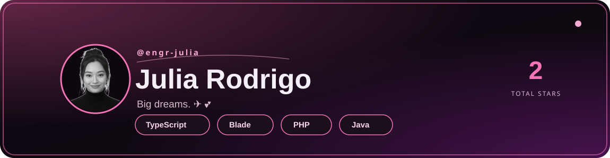

  

### About 

I’m a **Computer Science student** passionate about **data engineering, data science, and problem-solving**.  
My goal is to build strong foundations in **data management, pipelines, and cloud technologies** as I work toward becoming a **Big Data Engineer**. 

 

- 📍 Based in **Philippines**
- 🔭 Mapping out my journey to become a **Big Data Engineer**
- 👯 Excited to collaborate on **data management, cleaning, and pipeline projects**
- 🤝 Open to mentorship and opportunities in the **Big Data field**
- 🌱 Currently learning **Data Science & Engineering concepts**
- ⚡ Fun fact: I believe data isn't just numbers — it's **stories waiting to be discovered**
- 👥 **9** followers · **5** following

 

### 🎓 Education

**Bachelor of Science in Computer Science**
*New Era University*

Currently pursuing my degree with a focus on computer science fundamentals, programming, and data systems.

 

### 🛠 Skillset

**Core Strengths**

`Problem-Solving` `Team Collaboration` `Communication & Presentation` `Data Analysis & Visualization`

 

---
### 📜 My Data Certifications' Road Map

  

  <table width="100%">
    <thead>
      <tr>
        <th align="left" width="50%">Certification</th>
        <th align="center" width="20%">Issuer</th>
        <th align="center" width="10%">Date</th>
        <th align="center" width="20%">Credential</th>
      </tr>
    </thead>
    <tbody>
      <tr>
        <td><b>OCI 2024 AI Foundations Associate</b></td>
        <td align="center">Oracle</td>
        <td align="center">2024</td>
        <td align="center"><a href="https://catalog-education.oracle.com/ords/certview/sharebadge?id=49CBA67A962309CC3E6AAA483B73864D47619BA224B6EEDD3E9FECF49D3B7942">Verify Credential</a></td>
      </tr>
      <tr>
        <td><b>OCI 2024 Data Foundations Associate</b></td>
        <td align="center">Oracle</td>
        <td align="center">2024</td>
        <td align="center"><a href="https://catalog-education.oracle.com/ords/certview/sharebadge?id=246808BA7BFB8CB524F0F4062E577184CE6D3E094E0A145CFAAA5049D5A820AE">Verify Credential</a></td>
      </tr>
      <tr>
        <td><b>OCI 2024 Certified Foundations Associate</b></td>
        <td align="center">Oracle</td>
        <td align="center">2024</td>
        <td align="center"><a href="https://catalog-education.oracle.com/ords/certview/sharebadge?id=246808BA7BFB8CB524F0F4062E5771843277A4CDC454053833BF7DB91936AEBF">Verify Credential</a></td>
      </tr>
      <tr>
        <td><b>SQL and Relational Databases 101</b></td>
        <td align="center">IBM</td>
        <td align="center">2024</td>
        <td align="center"><a href="https://courses.cognitiveclass.ai/certificates/8534fe56c2024b459015134d9ebb1dbc">Verify Credential</a></td>
      </tr>
      <tr>
        <td><b>Introduction to Data Science</b></td>
        <td align="center">IBM</td>
        <td align="center">2026</td>
        <td align="center"><a href="https://github.com/engr-julia/Engr-Julia/blob/main/certs/IBM%20DS0101EN%20Certificate%20_%20Cognitive%20Class.pdf">Verify Credential</a></td>
      </tr>
      <tr>
        <td><b>Getting Started in Google Analytics</b></td>
        <td align="center">Coursera</td>
        <td align="center">2026</td>
        <td align="center"><a href="https://github.com/engr-julia/Engr-Julia/blob/main/certs/COURSERA_GOOGLE%20ANALYTICS.pdf">Verify Credential</a></td>
      </tr>
    </tbody>
  </table>

---

### 💻 Tech Stack

**Languages**

**Data Science & ML**

**Databases & Cloud**

**Design**

**Tools & Hardware**

**Programming & Development**

**Data & Databases**

**Tools & Platforms**

---

  

---

### 📊 GitHub Stats

  
  

  

---

### 👤 GitHub Profile Overview

---
### 🌐 Connect with Me

|  |  |  |  |
|:---:|:---:|:---:|:---:|
| [Julia Rodrigo](https://facebook.com/JuliaRodrigo) | [crese.lia](https://instagram.com/crese.lia) | [crese.lia](https://tiktok.com/@crese.lia) | [engr.julia.rt@gmail.com](mailto:engr.julia.rt@gmail.com) |

